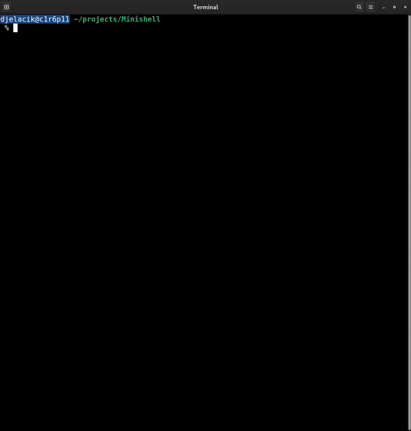

# **MINISHELL**

This README provides an overview of the **Minishell** project for 42 School [Hive Helsinki](https://www.hive.fi/en/), detailing its objectives and offering guidance. The goal of the project is to implement a simplified shell (command interpreter) in C, following the 42 Norm and POSIX standards. It should handle typical Unix commands, redirections, and pipe operations.

Here is a short demonstration of the Minishell in action:



---

## **Table of Contents**
1. [Introduction](#introduction)  
2. [Project Structure](#project-structure)  
3. [Installation and Compilation](#installation-and-compilation)  
4. [Running the Program](#running-the-program)  
5. [Minishell Features](#minishell-features)  
   - [Basic Commands](#basic-commands)  
   - [Redirections](#redirections)  
   - [Pipes](#pipes)  
   - [Built-in Commands](#built-in-commands)  
   - [Signal Handling](#signal-handling)  
   - [Extra Features](#extra-features)   
6. [Examples](#examples)  
7. [Debugging and Error Handling](#debugging-and-error-handling)   
10. [Conclusion](#conclusion)

---

## **Introduction**
Minishell is a project at Hive Helsinki aiming to enhance your understanding of:
- Process creation and management (`fork`, `exec`, `wait`).
- File descriptors and their redirection.
- Pipes, enabling inter-process communication.
- Signal handling (`SIGINT`, `SIGQUIT`, etc.).
- Structural coding and modular design.

The general purpose is to provide a simplified shell that allows users to execute commands, leverage built-in commands, and use many Bash-like functionalities.

---

## **Project Structure**
Minishell can be divided into several major components:

1. **Parser** – Parses the user’s input (commands, arguments, pipes, redirections, etc.).  
2. **Executor** – Executes parsed commands (forks new processes and calls `execve`).  
3. **Redirections** – Manages `<`, `>`, `>>`, and `<<` (heredoc) redirections.  
4. **Built-in Commands** – Implements certain shell internal commands (e.g., `cd`, `echo`, `env`, `exit`).  
5. **Signal Handling** – Handles signals such as Ctrl-C, Ctrl-\ in both parent and child processes.  
6. **Helper Functions** – Includes memory management, error printing, file open/read/close utilities, etc.

---

## **Installation and Compilation**
Below is a general example of how to build the project.

1. Ensure you have **gcc** or another C compiler installed, as well as **make**.  
2. Download or clone the project source code.  
3. Change directory into the project folder:
   ```bash
   cd minishell
4. Run:
make:
   ```bash
   make
   ```
   This will compile the necessary .c files and produce an executable (e.g., minishell).

---

## **Running the Program**
Once successfully compiled, launch Minishell by running:

```bash
./minishell
```
You should see a prompt **minishell%**. Try typing the same commands you would in Bash:
```
minishell% echo "Hello Minishell!"
Hello Minishell!
minishell% cd ..
minishell% ls -l
```
To exit, use the exit command or press Ctrl-D

---

## **Minishell Features**

### **Basic Commands**
- Minishell searches for the command path in the `$PATH` environment variable, or checks if it is a built-in command.
- If found, Minishell forks a new process and calls `execve`.
- If the command is not found, an error message is printed.
  
### **Redirections**
- **`>`** Redirects output to the specified file (overwrites the file).
- **`>>`** Appends output to the end of the specified file.
- **`<`** Reads input from the specified file.
- **`<<` (heredoc)** Reads input from user input until the specified delimiter is reached, then writes that input into a pipe for the command to read.

### **Pipes**
- **`|`** Connects multiple commands on a single command line. The output of one command becomes the input of the next.
- Minishell creates a pipe for each `|`, adjusting the stdin/stdout in each child process accordingly.

### **Built-in Commands**
- **`echo`** Prints the provided arguments.
- **`cd`** Changes the current working directory.
- **`pwd`** Prints the current working directory path.
- **`export`** Sets environment variables.
- **`unset`** Removes environment variables.
- **`env`** Displays the current environment variables.
- **`exit`** Exits Minishell.

### **Signal Handling**
- **SIGINT (Ctrl-C)**: Interrupts the current process or returns Minishell to a new prompt.
- **SIGQUIT (Ctrl-\)**: May terminate the currently running process or remain silent, depending on your implementation.
- It is important to distinguish whether you are in the parent or child process to manage signals correctly.

### **Extra Features**
- **`$?`** – Variable that stores the exit status of the last executed command.
- **Quote parsing** – Handling strings in single and double quotes.

---

## **Examples**

### 1. Simple Command
```bash
minishell% echo "Hello World"
Hello World
```
### 2. Redirection
```bash
minishell% ls > filelist.txt
minishell% cat filelist.txt
... (content of the ls command)
```
### 3. Pipe
```bash
minishell% ls -l | grep minishell
drwxr-xr-x   5 user  user       160 Dec 20 10:44 minishell
```
### 4. Heredoc
```bash
minishell% cat << EOF
> Some text
> more text
> EOF
Some text
more text
```
### 5. Built-in Commands (cd and pwd)
```bash
minishell% pwd
/home/user/projects/minishell
minishell% cd ..
minishell% pwd
/home/user/projects
```

---

## **Debugging and Error Handling**
- **Debug prints**: If you'd like to compile Minishell in debug mode, you can define debug prints in your header files to display additional logs (such as parser states and token details).  
- **Error messages**: It's crucial to detect cases where commands or files are missing, or the user provided incomplete arguments (for example, `cd` without a path). Make sure you return clear messages (e.g., `minishell: command not found: ...`).  
- **Memory leaks**: A suppression file (`readline.supp`) is provided so Valgrind ignores any `readline`-specific leaks. This lets you focus on managing your Minishell’s resources. Below is an example command for running Valgrind with the suppression file:
```bash
  valgrind -v --suppressions=readline.supp --leak-check=full --show-leak-kinds=all ./minishell
```

---

## **Conclusion**

The Minishell project turned out to be much larger and more demanding than I initially anticipated. Working with process management, pipes, and redirections gave me a far deeper understanding of how a command-line interpreter operates under the hood. In particular, the multi-stage parsing logic and signal handling required careful planning and intensive testing.

Although it took a considerable amount of time and effort, it was a highly rewarding learning experience. I now feel more confident handling processes, file descriptors, and structuring. I believe these skills will be valuable for future projects and challenges.
